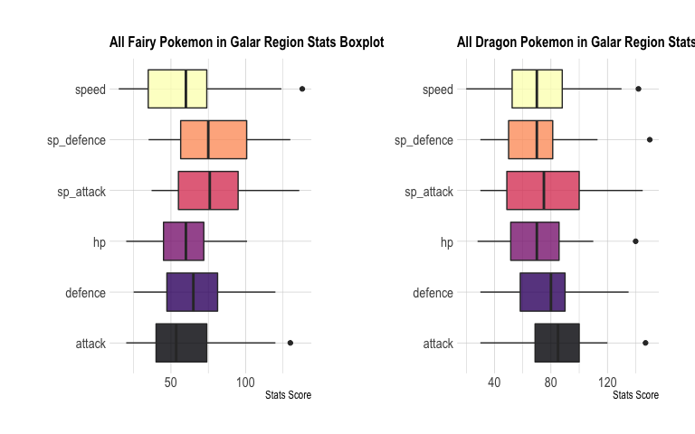
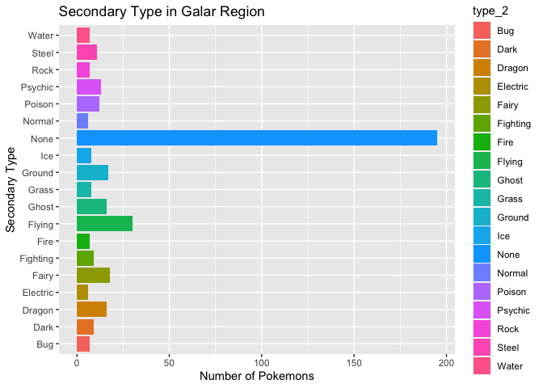
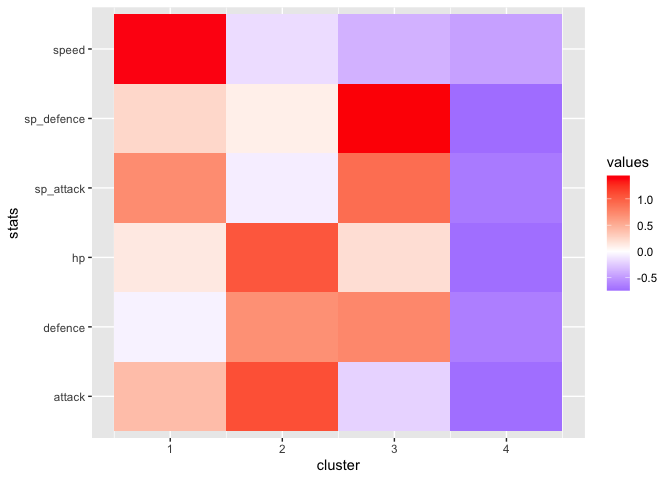
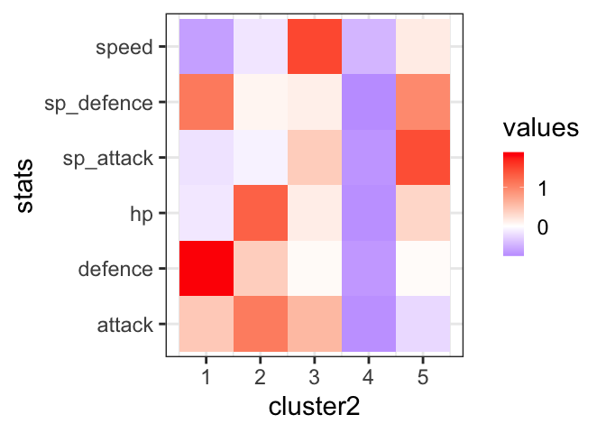

``` r
# Load the libraries
library(rvest)
```

    ## Loading required package: xml2

``` r
library(dplyr)
```

    ## 
    ## Attaching package: 'dplyr'

    ## The following objects are masked from 'package:stats':
    ## 
    ##     filter, lag

    ## The following objects are masked from 'package:base':
    ## 
    ##     intersect, setdiff, setequal, union

``` r
library(tidyr)
library(stringr)
library(ggplot2)
```

This is a project combined with web scraping and data cleaning. The data
sets are from two different website. One is called `serebii.net`that
collects Pokemon stats and info and the other website is named `IGN`, a
famous games review website.


## Web Scraping

``` r
link <- "https://www.serebii.net/swordshield/galarpokedex.shtml"
pokemon_ss <- read_html(link) %>%  # web scraping
  html_nodes("table.tab")%>%   # CSS selector
  html_table(fill=TRUE)%>%.[[2]] 
head(pokemon_ss)
```

    ##     X1   X2   X3                 X4                    X5         X6         X7
    ## 1  No.  Pic Name          Abilities                  Type Base Stats Base Stats
    ## 2  No.  Pic Name          Abilities                  Type         HP        Att
    ## 3 #001              Grookeyサルノリ Overgrow Grassy Surge                    50
    ## 4      <NA> <NA>               <NA>                  <NA>       <NA>       <NA>
    ## 5 #002           Thwackeyバチンキー Overgrow Grassy Surge                    70
    ## 6      <NA> <NA>               <NA>                  <NA>       <NA>       <NA>
    ##           X8         X9        X10        X11 X12
    ## 1 Base Stats Base Stats Base Stats Base Stats  NA
    ## 2        Def      S.Att      S.Def        Spd  NA
    ## 3         65         50         40         40  65
    ## 4       <NA>       <NA>       <NA>       <NA>  NA
    ## 5         85         70         55         60  80
    ## 6       <NA>       <NA>       <NA>       <NA>  NA

The pokemon\_ss data set looks pretty bad and we are going to do some
data wrangling soon. This data does not have the type column since
serebii.net used pictures, and R web scraping cannot transform pictures
into text, however the IGN has another data set which includes the type
column. Thus, we can use Pokemon ID to merge two data sets together.

``` r
link_2 <- "https://www.ign.com/wikis/pokemon-sword-shield/List_of_Pokemon_(Pokedex)#Galarian_Pokedex"
pokemon_type <- read_html(link_2) %>%  # web scraping
  html_nodes("table")%>%   # CSS selector
  html_table(fill=TRUE)%>%.[[1]]
head(pokemon_type)
```

    ##   #   Pokemon  Type Location(s) Found
    ## 1 1   Grookey Grass   Starter Pokemon
    ## 2 2  Thwackey Grass    Evolve Grookey
    ## 3 3 Rillaboom Grass   Evolve Thwackey
    ## 4 4 Scorbunny  Fire   Starter Pokemon
    ## 5 5    Raboot  Fire  Evolve Scorbunny
    ## 6 6 Cinderace  Fire  Evolve Cinderace

## Data Cleaning

``` r
colnames(pokemon_ss) # check column names 
```

    ##  [1] "X1"  "X2"  "X3"  "X4"  "X5"  "X6"  "X7"  "X8"  "X9"  "X10" "X11" "X12"

``` r
pokemon_ss <- pokemon_ss[,-6]   # remove sixth column
pokemon_ss <- pokemon_ss[,-2:-3] # remove second, third column

colnames(pokemon_ss) <- c("No.","Name","Abilities","HP","Attack","Defence","Sp_Attack","Sp.Defence","Speed")
# change column name

pokemon_ss <- pokemon_ss[-1:-2,] # remove first, second rows

pokemon_ss <- na.omit(pokemon_ss) # remove all the NA rows 
```

``` r
pokemon_ss$No. <-  str_replace_all(pokemon_ss$No.,"\\#","") # remove # at the beginning of the No. column

pokemon_ss$No. <- as.numeric(pokemon_ss$No.) # change into numeric
```

``` r
unique(pokemon_ss$No.)   # there are 400 unique observations
```

    ##   [1]   1   2   3   4   5   6   7   8   9  10  11  12  13  14  15  16  17  18
    ##  [19]  19  20  21  22  23  24  25  26  27  28  29  30  31  32  33  34  35  36
    ##  [37]  37  38  39  40  41  42  43  44  45  46  47  48  49  50  51  52  53  54
    ##  [55]  55  56  57  58  59  60  61  62  63  64  65  66  67  68  69  70  71  72
    ##  [73]  73  74  75  76  77  78  79  80  81  82  83  84  85  86  87  88  89  90
    ##  [91]  91  92  93  94  95  96  97  98  99 100 101 102 103 104 105 106 107 108
    ## [109] 109 110 111 112 113 114 115 116 117 118 119 120 121 122 123 124 125 126
    ## [127] 127 128 129 130 131 132 133 134 135 136 137 138 139 140 141 142 143 144
    ## [145] 145 146 147 148 149 150 151 152 153 154 155 156 157 158 159 160 161 162
    ## [163] 163 164 165 166 167 168 169 170 171 172 173 174 175 176 177 178 179 180
    ## [181] 181 182 183 184 185 186 187 188 189 190 191 192 193 194 195 196 197 198
    ## [199] 199 200 201 202 203 204 205 206 207 208 209 210 211 212 213 214 215 216
    ## [217] 217 218 219 220 221 222 223 224 225 226 227 228 229 230 231 232 233 234
    ## [235] 235 236 237 238 239 240 241 242 243 244 245 246 247 248 249 250 251 252
    ## [253] 253 254 255 256 257 258 259 260 261 262 263 264 265 266 267 268 269 270
    ## [271] 271 272 273 274 275 276 277 278 279 280 281 282 283 284 285 286 287 288
    ## [289] 289 290 291 292 293 294 295 296 297 298 299 300 301 302 303 304 305 306
    ## [307] 307 308 309 310 311 312 313 314 315 316 317 318 319 320 321 322 323 324
    ## [325] 325 326 327 328 329 330 331 332 333 334 335 336 337 338 339 340 341 342
    ## [343] 343 344 345 346 347 348 349 350 351 352 353 354 355 356 357 358 359 360
    ## [361] 361 362 363 364 365 366 367 368 369 370 371 372 373 374 375 376 377 378
    ## [379] 379 380 381 382 383 384 385 386 387 388 389 390 391 392 393 394 395 396
    ## [397] 397 398 399 400

``` r
unique(pokemon_type$`#`) # there are 400 unique observations
```

    ##   [1]   1   2   3   4   5   6   7   8   9  10  11  12  13  14  15  16  17  18
    ##  [19]  19  20  21  22  23  24  25  26  27  28  29  30  31  32  33  34  35  36
    ##  [37]  37  38  39  40  41  42  43  44  45  46  47  48  49  50  51  52  53  54
    ##  [55]  55  56  57  58  59  60  61  62  63  64  65  66  67  68  69  70  71  72
    ##  [73]  73  74  75  76  77  78  79  80  81  82  83  84  85  86  87  88  89  90
    ##  [91]  91  92  93  94  95  96  97  98  99 100 101 102 103 104 105 106 107 108
    ## [109] 109 110 111 112 113 114 115 116 117 118 119 120 121 122 123 124 125 126
    ## [127] 127 128 129 130 131 132 133 134 135 136 137 138 139 140 141 142 143 144
    ## [145] 145 146 147 148 149 150 151 152 153 154 155 156 157 158 159 160 161 162
    ## [163] 163 164 165 166 167 168 169 170 171 172 173 174 175 176 177 178 179 180
    ## [181] 181 182 183 184 185 186 187 188 189 190 191 192 193 194 195 196 197 198
    ## [199] 199 200 201 202 203 204 205 206 207 208 209 210 211 212 213 214 215 216
    ## [217] 217 218 219 220 221 222 223 224 225 226 227 228 229 230 231 232 233 234
    ## [235] 235 236 237 238 239 240 241 242 243 244 245 246 247 248 249 250 251 252
    ## [253] 253 254 255 256 257 258 259 260 261 262 263 264 265 266 267 268 269 270
    ## [271] 271 272 273 274 275 276 277 278 279 280 281 282 283 284 285 286 287 288
    ## [289] 289 290 291 292 293 294 295 296 297 298 299 300 301 302 303 304 305 306
    ## [307] 307 308 309 310 311 312 313 314 315 316 317 318 319 320 321 322 323 324
    ## [325] 325 326 327 328 329 330 331 332 333 334 335 336 337 338 339 340 341 342
    ## [343] 343 344 345 346 347 348 349 350 351 352 353 354 355 356 357 358 359 360
    ## [361] 361 362 363 364 365 366 367 368 369 370 371 372 373 374 375 376 377 378
    ## [379] 379 380 381 382 383 384 385 386 387 388 389 390 391 392 393 394 395 396
    ## [397] 397 398 399 400

``` r
pokemon_list <- merge(pokemon_type, pokemon_ss, by.x = "#", by.y = "No.")  # merge two data sets together

colnames(pokemon_list) <- tolower(colnames(pokemon_list)) # make column names lower case

pokemon_list <- pokemon_list%>%
  rename(No.="#")  # rename column name
  
pokemon_list <- pokemon_list%>%  
  rename(locations_found="location(s) found")# rename the column name

summary(as.factor(pokemon_list$No.)) # use factor we can see which # has duplicates No.182 and No.327
```

    ##     182     327       1       2       3       4       5       6       7       8 
    ##       2       2       1       1       1       1       1       1       1       1 
    ##       9      10      11      12      13      14      15      16      17      18 
    ##       1       1       1       1       1       1       1       1       1       1 
    ##      19      20      21      22      23      24      25      26      27      28 
    ##       1       1       1       1       1       1       1       1       1       1 
    ##      29      30      31      32      33      34      35      36      37      38 
    ##       1       1       1       1       1       1       1       1       1       1 
    ##      39      40      41      42      43      44      45      46      47      48 
    ##       1       1       1       1       1       1       1       1       1       1 
    ##      49      50      51      52      53      54      55      56      57      58 
    ##       1       1       1       1       1       1       1       1       1       1 
    ##      59      60      61      62      63      64      65      66      67      68 
    ##       1       1       1       1       1       1       1       1       1       1 
    ##      69      70      71      72      73      74      75      76      77      78 
    ##       1       1       1       1       1       1       1       1       1       1 
    ##      79      80      81      82      83      84      85      86      87      88 
    ##       1       1       1       1       1       1       1       1       1       1 
    ##      89      90      91      92      93      94      95      96      97 (Other) 
    ##       1       1       1       1       1       1       1       1       1     301

``` r
# we can pull No.182 and No.327 out 

pokemon_list[pokemon_list$No.==182,]
```

    ##     No.         pokemon   type         locations_found           name
    ## 182 182 Galarian Meowth  Steel Route 4Max Raid Battles Meowthニャース
    ## 183 182          Meowth Normal               NPC Trade Meowthニャース
    ##                      abilities hp attack defence sp_attack sp.defence speed
    ## 182 Pickup Tough Claws Unnerve 50     65      55        40         40    40
    ## 183 Pickup Tough Claws Unnerve 50     65      55        40         40    40

``` r
pokemon_list[pokemon_list$No.==327,]
```

    ##     No.         pokemon        type         locations_found           name
    ## 328 327 Galarian Yamask GroundGhost Route 6Max Raid Battles Yamaskデスマス
    ## 329 327   Unovan Yamask       Ghost               NPC Trade Yamaskデスマス
    ##            abilities hp attack defence sp_attack sp.defence speed
    ## 328 Wandering Spirit 38     55      85        30         65    30
    ## 329 Wandering Spirit 38     55      85        30         65    30

``` r
#Both Pokemons have different types although they do have the same stats, we still decide to keep them in the data set
```

``` r
colnames(pokemon_list) <- c("No.","pokemon_name","type","locations_found","name",
                             "abilities","hp","attack", "defence","sp_attack",
                             "sp_defence","speed") 

pokemon_list <- pokemon_list[,-5] # remove duplicate column

col_order <- c("No.","pokemon_name","type",
               "abilities","locations_found","hp","attack", 
               "defence","sp_attack",
               "sp_defence","speed")  # set up correct column order

pokemon_list <- pokemon_list[, col_order] # organize the data set with correct column order

pokemon_list <- pokemon_list%>%
  mutate(No.=as.character(No.),
         type=as.factor(type),
         abilities=as.factor(abilities),
         hp=as.numeric(hp),
         attack=as.numeric(attack),
         defence=as.numeric(defence),
         sp_attack=as.numeric(sp_attack),
         sp_defence=as.numeric(sp_defence),
         speed=as.numeric(speed))

summary(pokemon_list) 
```

    ##      No.            pokemon_name             type    
    ##  Length:402         Length:402         Water   : 25  
    ##  Class :character   Class :character   Fighting: 21  
    ##  Mode  :character   Mode  :character   Psychic : 18  
    ##                                        Grass   : 14  
    ##                                        Normal  : 14  
    ##                                        Ice     : 13  
    ##                                        (Other) :297  
    ##                              abilities   locations_found          hp        
    ##  Levitate                         : 11   Length:402         Min.   :  1.00  
    ##  Big Pecks Super Luck Rivalry     :  3   Class :character   1st Qu.: 50.00  
    ##  Blaze Libero                     :  3   Mode  :character   Median : 65.00  
    ##  Blaze Solar Power                :  3                      Mean   : 66.33  
    ##  Bulletproof Soundproof Overcoat  :  3                      3rd Qu.: 78.00  
    ##  Chlorophyll Early Bird Pickpocket:  3                      Max.   :190.00  
    ##  (Other)                          :376                                      
    ##      attack          defence         sp_attack        sp_defence    
    ##  Min.   : 10.00   Min.   : 15.00   Min.   : 10.00   Min.   : 20.00  
    ##  1st Qu.: 50.00   1st Qu.: 50.00   1st Qu.: 45.00   1st Qu.: 50.00  
    ##  Median : 70.00   Median : 66.50   Median : 60.00   Median : 65.00  
    ##  Mean   : 73.59   Mean   : 71.96   Mean   : 64.97   Mean   : 68.76  
    ##  3rd Qu.: 95.00   3rd Qu.: 90.00   3rd Qu.: 85.00   3rd Qu.: 85.00  
    ##  Max.   :147.00   Max.   :230.00   Max.   :145.00   Max.   :230.00  
    ##                                                                     
    ##      speed       
    ##  Min.   :  5.00  
    ##  1st Qu.: 40.00  
    ##  Median : 60.00  
    ##  Mean   : 61.32  
    ##  3rd Qu.: 80.00  
    ##  Max.   :160.00  
    ## 

``` r
pokemon_list$type <- str_replace_all(pokemon_list$type,
                                     "(?<=[a-z])(?=[A-Z])", #find small letters connected with capital letter                                                             
                                     "\n") # separate the pattern with space
pokemon_list <-  pokemon_list%>%
  separate(col=type,
           into=c("type_1","type_2"), # separate the type column into two columns between space 
           sep="\n")
```

    ## Warning: Expected 2 pieces. Missing pieces filled with `NA` in 195 rows [1, 2,
    ## 3, 4, 5, 6, 7, 8, 9, 10, 13, 14, 16, 21, 22, 24, 25, 29, 30, 34, ...].

``` r
pokemon_list <-  pokemon_list%>%  
  mutate(type_1=as.factor(type_1),  # change type_1 into factor
         type_2=as.factor(type_2)) # change type_2 into factor

print(unique(pokemon_list$type_1))  # we found a typo there is one category named poison and the other named posion
```

    ##  [1] Grass    Fire     Water    Bug      Normal   Flying   Dark     Electric
    ##  [9] Ice      Ground   Psychic  Fighting Steel    Ghost    Poison   Rock    
    ## [17] Fairy    Dragon   Posion  
    ## 19 Levels: Bug Dark Dragon Electric Fairy Fighting Fire Flying Ghost ... Water

``` r
print(unique(pokemon_list$type_2)) # no duplicates in this column, but NA does not help us too much let's change those NAs into None
```

    ##  [1] <NA>     Psychic  Flying   Electric Steel    Normal   Grass    Dark    
    ##  [9] Rock     Ground   Poison   Ghost    Fighting Ice      Fairy    Bug     
    ## [17] Fire     Dragon   Water   
    ## 18 Levels: Bug Dark Dragon Electric Fairy Fighting Fire Flying Ghost ... Water

``` r
pokemon_list$type_1[pokemon_list$type_1=="Posion"] <- "Poison" # change type_1 "posion" into correct name 

pokemon_list <- pokemon_list%>% 
  mutate(type_2=as.character(type_2))%>%  
  mutate(type_2=if_else(is.na(type_2),"None",type_2))%>% # change NAs to None
  mutate(type_2=as.factor(type_2))

summary(pokemon_list$type_2) # double check type_2 summary
```

    ##      Bug     Dark   Dragon Electric    Fairy Fighting     Fire   Flying 
    ##        7        9       16        6       18        9        7       30 
    ##    Ghost    Grass   Ground      Ice     None   Normal   Poison  Psychic 
    ##       16        8       17        8      195        6       12       13 
    ##     Rock    Steel    Water 
    ##        7       11        7

``` r
pokemon_list_long <- pokemon_list%>%  
  pivot_longer(cols=hp:speed,   # transform into long table
               names_to="stats_type",
               values_to="score")

head(pokemon_list_long)
```

    ## # A tibble: 6 x 8
    ##   No.   pokemon_name type_1 type_2 abilities    locations_found stats_type score
    ##   <chr> <chr>        <fct>  <fct>  <fct>        <chr>           <chr>      <dbl>
    ## 1 1     Grookey      Grass  None   Overgrow Gr… Starter Pokemon hp            50
    ## 2 1     Grookey      Grass  None   Overgrow Gr… Starter Pokemon attack        65
    ## 3 1     Grookey      Grass  None   Overgrow Gr… Starter Pokemon defence       50
    ## 4 1     Grookey      Grass  None   Overgrow Gr… Starter Pokemon sp_attack     40
    ## 5 1     Grookey      Grass  None   Overgrow Gr… Starter Pokemon sp_defence    40
    ## 6 1     Grookey      Grass  None   Overgrow Gr… Starter Pokemon speed         65

## Data Analysis

We can look at all the stats use boxplot for all the Pokemon

``` r
ggplot(pokemon_list_long, aes(x = score , y = stats_type)) +
  geom_boxplot() + 
  theme_minimal()+
  facet_wrap(~type_1)
```

<!-- -->

``` r
library(viridis)
```

    ## Loading required package: viridisLite

``` r
library(hrbrthemes)
```

    ## NOTE: Either Arial Narrow or Roboto Condensed fonts are required to use these themes.

    ##       Please use hrbrthemes::import_roboto_condensed() to install Roboto Condensed and

    ##       if Arial Narrow is not on your system, please see https://bit.ly/arialnarrow

``` r
par(mfrow=c(2,2))
# Plot
pokemon_list_long %>%
  ggplot( aes(x=score, y=stats_type,fill=stats_type)) +
    geom_boxplot() +
    scale_fill_viridis(discrete = TRUE, alpha=0.8, option="A") +
    theme_ipsum() +
    theme(
      legend.position="none",
      plot.title = element_text(size=12)
    ) +
    ggtitle("All Pokemon in Galar Region Stats Boxplot") +
    xlab("Stats Score")+
    ylab("")
```

<!-- -->

``` r
g3 <- pokemon_list_long %>%
  filter(type_1=="Fairy" | type_2=="Fairy")%>%
  ggplot( aes(x=score, y=stats_type,fill=stats_type)) +
    geom_boxplot() +
    scale_fill_viridis(discrete = TRUE, alpha=0.8, option="A") +
    theme_ipsum() +
    theme(
      legend.position="none",
      plot.title = element_text(size=12)
    ) +
    ggtitle("All Fairy Pokemon in Galar Region Stats Boxplot") +
    xlab("Stats Score")+
    ylab("")
```

``` r
g4 <- pokemon_list_long %>%
  filter(type_1=="Dragon" | type_2=="Dragon")%>%
  ggplot( aes(x=score, y=stats_type,fill=stats_type)) +
    geom_boxplot() +
    scale_fill_viridis(discrete = TRUE, alpha=0.8, option="A") +
    theme_ipsum() +
    theme(
      legend.position="none",
      plot.title = element_text(size=12)
    ) +
    ggtitle("All Dragon Pokemon in Galar Region Stats Boxplot") +
    xlab("Stats Score")+
    ylab("")
```

``` r
library(ggpubr)
ggarrange(g3, g4,
          ncol = 2, nrow = 1)
```

    ## Warning in grid.Call(C_stringMetric, as.graphicsAnnot(x$label)): font family
    ## 'Arial Narrow' not found in PostScript font database
    
    ## Warning in grid.Call(C_stringMetric, as.graphicsAnnot(x$label)): font family
    ## 'Arial Narrow' not found in PostScript font database
    
    ## Warning in grid.Call(C_stringMetric, as.graphicsAnnot(x$label)): font family
    ## 'Arial Narrow' not found in PostScript font database
    
    ## Warning in grid.Call(C_stringMetric, as.graphicsAnnot(x$label)): font family
    ## 'Arial Narrow' not found in PostScript font database
    
    ## Warning in grid.Call(C_stringMetric, as.graphicsAnnot(x$label)): font family
    ## 'Arial Narrow' not found in PostScript font database
    
    ## Warning in grid.Call(C_stringMetric, as.graphicsAnnot(x$label)): font family
    ## 'Arial Narrow' not found in PostScript font database
    
    ## Warning in grid.Call(C_stringMetric, as.graphicsAnnot(x$label)): font family
    ## 'Arial Narrow' not found in PostScript font database
    
    ## Warning in grid.Call(C_stringMetric, as.graphicsAnnot(x$label)): font family
    ## 'Arial Narrow' not found in PostScript font database
    
    ## Warning in grid.Call(C_stringMetric, as.graphicsAnnot(x$label)): font family
    ## 'Arial Narrow' not found in PostScript font database
    
    ## Warning in grid.Call(C_stringMetric, as.graphicsAnnot(x$label)): font family
    ## 'Arial Narrow' not found in PostScript font database
    
    ## Warning in grid.Call(C_stringMetric, as.graphicsAnnot(x$label)): font family
    ## 'Arial Narrow' not found in PostScript font database
    
    ## Warning in grid.Call(C_stringMetric, as.graphicsAnnot(x$label)): font family
    ## 'Arial Narrow' not found in PostScript font database
    
    ## Warning in grid.Call(C_stringMetric, as.graphicsAnnot(x$label)): font family
    ## 'Arial Narrow' not found in PostScript font database
    
    ## Warning in grid.Call(C_stringMetric, as.graphicsAnnot(x$label)): font family
    ## 'Arial Narrow' not found in PostScript font database
    
    ## Warning in grid.Call(C_stringMetric, as.graphicsAnnot(x$label)): font family
    ## 'Arial Narrow' not found in PostScript font database
    
    ## Warning in grid.Call(C_stringMetric, as.graphicsAnnot(x$label)): font family
    ## 'Arial Narrow' not found in PostScript font database
    
    ## Warning in grid.Call(C_stringMetric, as.graphicsAnnot(x$label)): font family
    ## 'Arial Narrow' not found in PostScript font database
    
    ## Warning in grid.Call(C_stringMetric, as.graphicsAnnot(x$label)): font family
    ## 'Arial Narrow' not found in PostScript font database
    
    ## Warning in grid.Call(C_stringMetric, as.graphicsAnnot(x$label)): font family
    ## 'Arial Narrow' not found in PostScript font database
    
    ## Warning in grid.Call(C_stringMetric, as.graphicsAnnot(x$label)): font family
    ## 'Arial Narrow' not found in PostScript font database
    
    ## Warning in grid.Call(C_stringMetric, as.graphicsAnnot(x$label)): font family
    ## 'Arial Narrow' not found in PostScript font database
    
    ## Warning in grid.Call(C_stringMetric, as.graphicsAnnot(x$label)): font family
    ## 'Arial Narrow' not found in PostScript font database
    
    ## Warning in grid.Call(C_stringMetric, as.graphicsAnnot(x$label)): font family
    ## 'Arial Narrow' not found in PostScript font database
    
    ## Warning in grid.Call(C_stringMetric, as.graphicsAnnot(x$label)): font family
    ## 'Arial Narrow' not found in PostScript font database
    
    ## Warning in grid.Call(C_stringMetric, as.graphicsAnnot(x$label)): font family
    ## 'Arial Narrow' not found in PostScript font database
    
    ## Warning in grid.Call(C_stringMetric, as.graphicsAnnot(x$label)): font family
    ## 'Arial Narrow' not found in PostScript font database
    
    ## Warning in grid.Call(C_stringMetric, as.graphicsAnnot(x$label)): font family
    ## 'Arial Narrow' not found in PostScript font database
    
    ## Warning in grid.Call(C_stringMetric, as.graphicsAnnot(x$label)): font family
    ## 'Arial Narrow' not found in PostScript font database
    
    ## Warning in grid.Call(C_stringMetric, as.graphicsAnnot(x$label)): font family
    ## 'Arial Narrow' not found in PostScript font database
    
    ## Warning in grid.Call(C_stringMetric, as.graphicsAnnot(x$label)): font family
    ## 'Arial Narrow' not found in PostScript font database
    
    ## Warning in grid.Call(C_stringMetric, as.graphicsAnnot(x$label)): font family
    ## 'Arial Narrow' not found in PostScript font database
    
    ## Warning in grid.Call(C_stringMetric, as.graphicsAnnot(x$label)): font family
    ## 'Arial Narrow' not found in PostScript font database
    
    ## Warning in grid.Call(C_stringMetric, as.graphicsAnnot(x$label)): font family
    ## 'Arial Narrow' not found in PostScript font database
    
    ## Warning in grid.Call(C_stringMetric, as.graphicsAnnot(x$label)): font family
    ## 'Arial Narrow' not found in PostScript font database
    
    ## Warning in grid.Call(C_stringMetric, as.graphicsAnnot(x$label)): font family
    ## 'Arial Narrow' not found in PostScript font database
    
    ## Warning in grid.Call(C_stringMetric, as.graphicsAnnot(x$label)): font family
    ## 'Arial Narrow' not found in PostScript font database
    
    ## Warning in grid.Call(C_stringMetric, as.graphicsAnnot(x$label)): font family
    ## 'Arial Narrow' not found in PostScript font database
    
    ## Warning in grid.Call(C_stringMetric, as.graphicsAnnot(x$label)): font family
    ## 'Arial Narrow' not found in PostScript font database
    
    ## Warning in grid.Call(C_stringMetric, as.graphicsAnnot(x$label)): font family
    ## 'Arial Narrow' not found in PostScript font database
    
    ## Warning in grid.Call(C_stringMetric, as.graphicsAnnot(x$label)): font family
    ## 'Arial Narrow' not found in PostScript font database
    
    ## Warning in grid.Call(C_stringMetric, as.graphicsAnnot(x$label)): font family
    ## 'Arial Narrow' not found in PostScript font database
    
    ## Warning in grid.Call(C_stringMetric, as.graphicsAnnot(x$label)): font family
    ## 'Arial Narrow' not found in PostScript font database

<!-- -->

``` r
primary_type <- pokemon_list%>%
  group_by(type_1)%>%
  summarise(count=n())%>%
  arrange(-count)
```

    ## `summarise()` ungrouping output (override with `.groups` argument)

``` r
ggplot(data=primary_type, aes(x=type_1,y=count,fill=type_1))+
  geom_bar(position="dodge",stat="identity") +
  coord_flip()+
  ggtitle("Primary Type in Galar Region")+
  xlab("Primary Type")+
  ylab("Number of Pokemons")
```

<!-- -->

``` r
secondary_type <- pokemon_list%>%
  group_by(type_2)%>%
  summarise(count=n())%>%
  arrange(-count)
```

    ## `summarise()` ungrouping output (override with `.groups` argument)

``` r
ggplot(data=secondary_type, aes(x=type_2,y=count,fill=type_2))+
  geom_bar(position="dodge",stat="identity") +
  coord_flip()+
  ggtitle("Secondary Type in Galar Region")+
  xlab("Secondary Type")+
  ylab("Number of Pokemons")
```

<!-- -->

``` r
library(GGally)
```

    ## Registered S3 method overwritten by 'GGally':
    ##   method from   
    ##   +.gg   ggplot2

``` r
library(dplyr)
pokemon_stats <- pokemon_list%>%
  select(where(is.numeric))

ggpairs(pokemon_stats) 
```

<!-- -->

``` r
library(corrplot)
```

    ## corrplot 0.84 loaded

``` r
pokemon_list %>%
  select(where(is.numeric))%>%  # find all the numeric columns 
  cor()%>%
  corrplot(method = "number")
```

<!-- --> \#\# Shiny
interactive Web

If you think want to twist some variables or do some additional analysis
on this pokemon data set. I have developed a interactive web application
through Shiny, please click the link and check it out and take as much
time as you need\!

Shiny App Link: <https://caspar-hu23.shinyapps.io/Pokemon_App/>

## K-means cluster

Let’s use K-means cluster to find out the segments in this pokemon data
set

``` r
library(tidyr)
library(cluster)
library(factoextra) # clustering algorithms & visualization
```

    ## Welcome! Want to learn more? See two factoextra-related books at https://goo.gl/ve3WBa

``` r
library(sparcl) # Sparse Clustering
```

``` r
pokemon_new <- pokemon_list[,c("pokemon_name","hp","attack","defence","sp_attack","sp_defence","speed")]
# scale stats data 
pokemon_scale <- scale(pokemon_new[,2:7])

# Add pokemon names back to data frame
pokemon_new <- cbind.data.frame(pokemon_new$pokemon_name, pokemon_scale)  

names(pokemon_new)[1] <- "pokemon_name"  # Fix name of team column
```

### Initial Clustering

``` r
set.seed(111111) # Set seed for reproducibility
fit_1 <- kmeans(x = pokemon_new[,2:7], # Set data as explantory variables 
                centers = 4,  # Set number of clusters
                nstart = 25, # Set number of starts
                iter.max = 100 ) # Set maximum number of iterations to use
```

``` r
# Extract clusters
clusters_1 <- fit_1$cluster

# Extract centers
centers_1 <- fit_1$centers
```

Lets first check how many samples in each cluster:

``` r
# Check samples per cluster
summary(as.factor(clusters_1))
```

    ##   1   2   3   4 
    ##  83  92  64 163

Here we see that we have 83 samples in cluster 1, 92 in cluster 2, 64 in
cluster 3, and 163 in cluster 4. We can view the pokemons in each
cluster as follows:

``` r
# Check pokemons in cluster 1
cat("Cluster 1 Pokemon:\n")
```

    ## Cluster 1 Pokemon:

``` r
pokemon_new$pokemon_name[clusters_1 == 1]
```

    ##  [1] "Thwackey"          "Raboot"            "Cinderace"        
    ##  [4] "Drizzile"          "Inteleon"          "Butterfree"       
    ##  [7] "Unfezant"          "Thievul"           "Galarian Linoone" 
    ## [10] "Dubwool"           "Shiftry"           "Liepard"          
    ## [13] "Boltund"           "Diggersby"         "Cinccino"         
    ## [16] "Roselia"           "Roserade"          "Galvantula"       
    ## [19] "Manectric"         "Ninetales"         "Arcanine"         
    ## [22] "Vanilluxe"         "Glalie"            "Froslass"         
    ## [25] "Xatu"              "Ninjask"           "Hitmonlee"        
    ## [28] "Klinklang"         "Gallade"           "Cherrim"          
    ## [31] "Haunter"           "Gengar"            "Basculin"         
    ## [34] "Dugtrio"           "Swoobat"           "Noivern"          
    ## [37] "Barraskewda"       "Persian"           "Ribombee"         
    ## [40] "Raichu"            "Jolteon"           "Flareon"          
    ## [43] "Espeon"            "Flapple"           "Meowstic"         
    ## [46] "Slurpuff"          "Toxicroak"         "Salazzle"         
    ## [49] "Whimsicott"        "Accelgor"          "Drapion"          
    ## [52] "Sneasel"           "Weavile"           "Maractus"         
    ## [55] "Sigilyph"          "Lucario"           "Mimikyu"          
    ## [58] "Qwilfish"          "Cramorant"         "Toxtricity"       
    ## [61] "Durant"            "Heatmor"           "Heliolisk"        
    ## [64] "Hawlucha"          "Flygon"            "Galarian Ponyta"  
    ## [67] "Galarian Rapidash" "Indeedee"          "Morepeko"         
    ## [70] "Togedemaru"        "Galarian Mr. Mime" "Duraludon"        
    ## [73] "Rotom"             "Charmeleon"        "Charizard"        
    ## [76] "Silvally"          "Hydreigon"         "Hakamo-o"         
    ## [79] "Drakloak"          "Dragapult"         "Zacian"           
    ## [82] "Zamazenta"         "Eternatus"

``` r
# Check teams in cluster 2
cat("Cluster 2 Pokemon:\n")
```

    ## Cluster 2 Pokemon:

``` r
pokemon_new$pokemon_name[clusters_1 == 2]
```

    ##  [1] "Rillaboom"           "Charjabug"           "Corviknight"        
    ##  [4] "Greedent"            "Obstagoon"           "Drednaw"            
    ##  [7] "Tsareena"            "Piloswine"           "Mamoswine"          
    ## [10] "Mudbray"             "Mudsdale"            "Crustle"            
    ## [13] "Golurk"              "Bewear"              "Abomasnow"          
    ## [16] "Kingler"             "Quagsire"            "Crawdaunt"          
    ## [19] "Hitmonchan"          "Pangoro"             "Drifblim"           
    ## [22] "Skuntank"            "Seismitoad"          "Machoke"            
    ## [25] "Machamp"             "Gyarados"            "Seaking"            
    ## [28] "Octillery"           "Cloyster"            "Garbodor"           
    ## [31] "Centiskorch"         "Carkol"              "Coalossal"          
    ## [34] "Excadrill"           "Boldore"             "Gigalith"           
    ## [37] "Gurdurr"             "Conkeldurr"          "Steelix"            
    ## [40] "Perrserker"          "Gourgeist"           "Leafeon"            
    ## [43] "Appletun"            "Wobbuffet"           "Sirfetch’d"         
    ## [46] "Lanturn"             "Galarian Stunfisk"   "Whiscash"           
    ## [49] "Gastrodon"           "Golisopod"           "Barbaracle"         
    ## [52] "Grimmsnarl"          "Bisharp"             "Throh"              
    ## [55] "Sawk"                "Galarian Weezing"    "Sudowoodo"          
    ## [58] "Munchlax"            "Snorlax"             "Rhyhorn"            
    ## [61] "Rhydon"              "Rhyperior"           "Escavalier"         
    ## [64] "Beartic"             "Braviary"            "Mandibuzz"          
    ## [67] "Malamar"             "Copperajah"          "Sandaconda"         
    ## [70] "Hippowdon"           "Fraxure"             "Haxorus"            
    ## [73] "Doublade"            "Trevenant"           "Passimian"          
    ## [76] "Falinks"             "Grapploct"           "Wailmer"            
    ## [79] "Wailord"             "Avalugg"             "Dhelmise"           
    ## [82] "Lapras"              "Solrock"             "Galarian Darmanitan"
    ## [85] "Stonejourner"        "Dracozolt"           "Arctozolt"          
    ## [88] "Dracovish"           "Arctovish"           "Pupitar"            
    ## [91] "Tyranitar"           "Zweilous"

``` r
# Check teams in cluster 3
cat("Cluster 3 Pokemon:\n")
```

    ## Cluster 3 Pokemon:

``` r
pokemon_new$pokemon_name[clusters_1 == 3]
```

    ##  [1] "Orbeetle"         "Vikavolt"         "Noctowl"          "Ludicolo"        
    ##  [5] "Gloom"            "Vileplume"        "Bellossom"        "Pelipper"        
    ##  [9] "Claydol"          "Musharna"         "Hitmontop"        "Klang"           
    ## [13] "Vespiquen"        "Bronzong"         "Gardevoir"        "Eldegoss"        
    ## [17] "Dusclops"         "Dusknoir"         "Milotic"          "Pyukumuku"       
    ## [21] "Alcremie"         "Ferrothorn"       "Vaporeon"         "Umbreon"         
    ## [25] "Glaceon"          "Sylveon"          "Aromatisse"       "Araquanid"       
    ## [29] "Scrafty"          "Shuckle"          "Galarian Corsola" "Cursola"         
    ## [33] "Hatterene"        "Clefable"         "Togetic"          "Togekiss"        
    ## [37] "Gothorita"        "Gothitelle"       "Duosion"          "Reuniclus"       
    ## [41] "Beheeyem"         "Chandelure"       "Torkoal"          "Jellicent"       
    ## [45] "Toxapex"          "Runerigus"        "Cofagrigus"       "Aegislash"       
    ## [49] "Polteageist"      "Shiinotic"        "Oranguru"         "Drampa"          
    ## [53] "Turtonator"       "Frosmoth"         "Pinchurchin"      "Mantyke"         
    ## [57] "Mantine"          "Lunatone"         "Mr. Rime"         "Eiscue"          
    ## [61] "Type: Null"       "Sliggoo"          "Goodra"           "Kommo-o"

``` r
# Check teams in cluster 4
cat("Cluster 4 Pokemon:\n")
```

    ## Cluster 4 Pokemon:

``` r
pokemon_new$pokemon_name[clusters_1 == 4]
```

    ##   [1] "Grookey"             "Scorbunny"           "Sobble"             
    ##   [4] "Blipbug"             "Dottler"             "Caterpie"           
    ##   [7] "Metapod"             "Grubbin"             "Hoothoot"           
    ##  [10] "Rookidee"            "Corvisquire"         "Skwovet"            
    ##  [13] "Pidove"              "Tranquill"           "Nickit"             
    ##  [16] "Galarian Zigzagoon"  "Wooloo"              "Lotad"              
    ##  [19] "Lombre"              "Seedot"              "Nuzleaf"            
    ##  [22] "Chewtle"             "Purrloin"            "Yamper"             
    ##  [25] "Bunnelby"            "Minccino"            "Bounsweet"          
    ##  [28] "Steenee"             "Oddish"              "Budew"              
    ##  [31] "Wingull"             "Joltik"              "Electrike"          
    ##  [34] "Vulpix"              "Growlithe"           "Vanillite"          
    ##  [37] "Vanillish"           "Swinub"              "Delibird"           
    ##  [40] "Snorunt"             "Baltoy"              "Dwebble"            
    ##  [43] "Golett"              "Munna"               "Natu"               
    ##  [46] "Stufful"             "Snover"              "Krabby"             
    ##  [49] "Wooper"              "Corphish"            "Nincada"            
    ##  [52] "Shedinja"            "Tyrogue"             "Pancham"            
    ##  [55] "Klink"               "Combee"              "Bronzor"            
    ##  [58] "Ralts"               "Kirlia"              "Drifloon"           
    ##  [61] "Gossifleur"          "Cherubi"             "Stunky"             
    ##  [64] "Tympole"             "Palpitoad"           "Duskull"            
    ##  [67] "Machop"              "Gastly"              "Magikarp"           
    ##  [70] "Goldeen"             "Remoraid"            "Shellder"           
    ##  [73] "Feebas"              "Wishiwashi"          "Trubbish"           
    ##  [76] "Sizzlipede"          "Rolycoly"            "Diglett"            
    ##  [79] "Drilbur"             "Roggenrola"          "Timburr"            
    ##  [82] "Woobat"              "Noibat"              "Onix"               
    ##  [85] "Arrokuda"            "Galarian Meowth"     "Meowth"             
    ##  [88] "Milcery"             "Cutiefly"            "Ferroseed"          
    ##  [91] "Pumpkaboo"           "Pichu"               "Pikachu"            
    ##  [94] "Eevee"               "Applin"              "Espurr"             
    ##  [97] "Swirlix"             "Spritzee"            "Dewpider"           
    ## [100] "Wynaut"              "Galarian Farfetch’d" "Chinchou"           
    ## [103] "Croagunk"            "Scraggy"             "Barboach"           
    ## [106] "Shellos"             "Wimpod"              "Binacle"            
    ## [109] "Impidimp"            "Morgrem"             "Hatenna"            
    ## [112] "Hattrem"             "Salandit"            "Pawniard"           
    ## [115] "Koffing"             "Bonsly"              "Cleffa"             
    ## [118] "Clefairy"            "Togepi"              "Cottonee"           
    ## [121] "Gothita"             "Solosis"             "Karrablast"         
    ## [124] "Shelmet"             "Elgyem"              "Cubchoo"            
    ## [127] "Rufflet"             "Vullaby"             "Skorupi"            
    ## [130] "Litwick"             "Lampent"             "Inkay"              
    ## [133] "Sableye"             "Mawile"              "Riolu"              
    ## [136] "Cufant"              "Frillish"            "Mareanie"           
    ## [139] "Toxel"               "Silicobra"           "Hippopotas"         
    ## [142] "Helioptile"          "Trapinch"            "Vibrava"            
    ## [145] "Axew"                "Galarian Yamask"     "Unovan Yamask"      
    ## [148] "Honedge"             "Sinistea"            "Phantump"           
    ## [151] "Morelull"            "Snom"                "Clobbopus"          
    ## [154] "Bergmite"            "Mime Jr."            "Galarian Darumaka"  
    ## [157] "Ditto"               "Charmander"          "Larvitar"           
    ## [160] "Deino"               "Goomy"               "Jangmo-o"           
    ## [163] "Dreepy"

``` r
# Create vector of clusters
cluster <- c(1: 4)
# Extract centers
center_df <- data.frame(cluster, centers_1)

# Reshape the data
center_reshape <- gather(center_df, # set the data 
                         stats, # the col name for the select columns' name
                         values, # the col name for the select columns' value
                         hp:speed) # select columns 
```

    ## Coordinate system already present. Adding new coordinate system, which will replace the existing one.

<!-- -->

Overall, cluster 1 performs much more better than other three clusters.
Pokemons of cluster 1 are generally faster compared to pokemons in other
three clusters. Pokemons of cluster 2 are better at physical attack and
has a higher health value. Pokemons of cluster 3 are good at dealing
with special attack due to higher special defense. And cluster 4
performs generally worse at all six stats.

### Method 1 : Calculate Optimal Cluster Number (Elbow Method)

Let’s try to calculate the optimal cluster number to see if we have a
better set of clusters.  
In general, while we increase the number of clusters, error will always
decrease. The optimal cluster number is the one where rate of
improvement in performance begins to decrease. And that is how we can
find the optimal cluster number.

``` r
# Create function to try different cluster numbers
kmean_withinss <- function(k) {
  cluster <- kmeans( x = pokemon_new[,2:7],  # Set data to use
                    centers = k,  # Set number of clusters as k, changes with input into function
                    nstart = 25, # Set number of starts
                    iter.max = 100) # Set max number of iterations
  return (cluster$tot.withinss) # Return cluster error/within cluster sum of squares
}

# Set maximum cluster number
max_k <- 20
# Run algorithm over a range of cluster numbers
wss <- sapply(2:max_k, kmean_withinss)

# Create a data frame to plot the graph
elbow <-data.frame(2:max_k, wss)

# Plot the graph with gglop
g_1 <- ggplot(elbow, aes(x = X2.max_k, y = wss)) +  
  theme_set(theme_bw(base_size = 22) ) +
  geom_point(color = "blue") +
  geom_line() +
  scale_x_continuous(breaks = seq(1, 20, by = 1)) +
  labs(x = "Number of Clusters", y="Within Cluster \nSum of Squares") +
  theme(panel.grid.major = element_blank(), # Turn of the background grid
        panel.grid.minor = element_blank(),
        panel.border = element_blank(),
        panel.background = element_blank()) 
g_1
```

<!-- -->

It seems that the optimal number of clusters is five. So, let’s try it
out

``` r
set.seed(111111) # Set seed for reproducibility
fit_2 <- kmeans(x = pokemon_new[,2:7], # Set data as explantory variables 
                centers = 5,  # Set number of clusters
                nstart = 25, # Set number of starts
                iter.max = 100 ) # Set maximum number of iterations to use
```

``` r
# Extract clusters
clusters_2 <- fit_2$cluster

# Extract centers
centers_2 <- fit_2$centers

# Check samples per cluster
summary(as.factor(clusters_2))
```

    ##   1   2   3   4   5 
    ##  39  71  67 159  66

``` r
# Check pokemons in cluster 1
cat("Cluster 1 Pokemon:\n")
```

    ## Cluster 1 Pokemon:

``` r
pokemon_new$pokemon_name[clusters_2 == 1]
```

    ##  [1] "Charjabug"        "Claydol"          "Crustle"          "Hitmonchan"      
    ##  [5] "Hitmontop"        "Klang"            "Vespiquen"        "Bronzong"        
    ##  [9] "Dusclops"         "Dusknoir"         "Cloyster"         "Pyukumuku"       
    ## [13] "Gigalith"         "Onix"             "Steelix"          "Ferrothorn"      
    ## [17] "Gourgeist"        "Umbreon"          "Araquanid"        "Scrafty"         
    ## [21] "Shuckle"          "Golisopod"        "Barbaracle"       "Galarian Corsola"
    ## [25] "Galarian Weezing" "Sudowoodo"        "Escavalier"       "Torkoal"         
    ## [29] "Toxapex"          "Sandaconda"       "Runerigus"        "Cofagrigus"      
    ## [33] "Doublade"         "Aegislash"        "Turtonator"       "Pinchurchin"     
    ## [37] "Avalugg"          "Eiscue"           "Kommo-o"

``` r
# Check pokemons in cluster 2
cat("Cluster 2 Pokemon:\n")
```

    ## Cluster 2 Pokemon:

``` r
pokemon_new$pokemon_name[clusters_2 == 2]
```

    ##  [1] "Rillaboom"           "Corviknight"         "Greedent"           
    ##  [4] "Drednaw"             "Tsareena"            "Piloswine"          
    ##  [7] "Mamoswine"           "Mudbray"             "Mudsdale"           
    ## [10] "Golurk"              "Bewear"              "Kingler"            
    ## [13] "Quagsire"            "Crawdaunt"           "Pangoro"            
    ## [16] "Drifblim"            "Skuntank"            "Seismitoad"         
    ## [19] "Machoke"             "Machamp"             "Gyarados"           
    ## [22] "Seaking"             "Garbodor"            "Centiskorch"        
    ## [25] "Carkol"              "Coalossal"           "Excadrill"          
    ## [28] "Boldore"             "Gurdurr"             "Conkeldurr"         
    ## [31] "Perrserker"          "Appletun"            "Wobbuffet"          
    ## [34] "Sirfetch’d"          "Lanturn"             "Galarian Stunfisk"  
    ## [37] "Whiscash"            "Gastrodon"           "Grimmsnarl"         
    ## [40] "Bisharp"             "Throh"               "Sawk"               
    ## [43] "Munchlax"            "Snorlax"             "Rhyhorn"            
    ## [46] "Rhydon"              "Rhyperior"           "Beartic"            
    ## [49] "Braviary"            "Mandibuzz"           "Malamar"            
    ## [52] "Copperajah"          "Hippowdon"           "Fraxure"            
    ## [55] "Trevenant"           "Passimian"           "Grapploct"          
    ## [58] "Wailmer"             "Wailord"             "Dhelmise"           
    ## [61] "Lapras"              "Solrock"             "Galarian Darmanitan"
    ## [64] "Stonejourner"        "Dracozolt"           "Arctozolt"          
    ## [67] "Dracovish"           "Arctovish"           "Pupitar"            
    ## [70] "Tyranitar"           "Zweilous"

``` r
# Check pokemons in cluster 3
cat("Cluster 3 Pokemon:\n")
```

    ## Cluster 3 Pokemon:

``` r
pokemon_new$pokemon_name[clusters_2 == 3]
```

    ##  [1] "Thwackey"          "Raboot"            "Cinderace"        
    ##  [4] "Drizzile"          "Inteleon"          "Unfezant"         
    ##  [7] "Galarian Linoone"  "Obstagoon"         "Dubwool"          
    ## [10] "Shiftry"           "Liepard"           "Boltund"          
    ## [13] "Diggersby"         "Cinccino"          "Galvantula"       
    ## [16] "Manectric"         "Ninetales"         "Arcanine"         
    ## [19] "Glalie"            "Froslass"          "Xatu"             
    ## [22] "Ninjask"           "Hitmonlee"         "Klinklang"        
    ## [25] "Gallade"           "Basculin"          "Dugtrio"          
    ## [28] "Swoobat"           "Noivern"           "Barraskewda"      
    ## [31] "Persian"           "Ribombee"          "Raichu"           
    ## [34] "Jolteon"           "Leafeon"           "Flapple"          
    ## [37] "Meowstic"          "Toxicroak"         "Salazzle"         
    ## [40] "Whimsicott"        "Accelgor"          "Drapion"          
    ## [43] "Sneasel"           "Weavile"           "Lucario"          
    ## [46] "Mimikyu"           "Qwilfish"          "Cramorant"        
    ## [49] "Durant"            "Hawlucha"          "Flygon"           
    ## [52] "Haxorus"           "Galarian Ponyta"   "Galarian Rapidash"
    ## [55] "Morepeko"          "Falinks"           "Togedemaru"       
    ## [58] "Galarian Mr. Mime" "Duraludon"         "Charmeleon"       
    ## [61] "Charizard"         "Silvally"          "Hakamo-o"         
    ## [64] "Drakloak"          "Dragapult"         "Zacian"           
    ## [67] "Zamazenta"

``` r
# Check pokemons in cluster 4
cat("Cluster 4 Pokemon:\n")
```

    ## Cluster 4 Pokemon:

``` r
pokemon_new$pokemon_name[clusters_2 == 4]
```

    ##   [1] "Grookey"             "Scorbunny"           "Sobble"             
    ##   [4] "Blipbug"             "Dottler"             "Caterpie"           
    ##   [7] "Metapod"             "Grubbin"             "Hoothoot"           
    ##  [10] "Rookidee"            "Corvisquire"         "Skwovet"            
    ##  [13] "Pidove"              "Tranquill"           "Nickit"             
    ##  [16] "Galarian Zigzagoon"  "Wooloo"              "Lotad"              
    ##  [19] "Lombre"              "Seedot"              "Nuzleaf"            
    ##  [22] "Chewtle"             "Purrloin"            "Yamper"             
    ##  [25] "Bunnelby"            "Minccino"            "Bounsweet"          
    ##  [28] "Steenee"             "Oddish"              "Budew"              
    ##  [31] "Wingull"             "Joltik"              "Electrike"          
    ##  [34] "Vulpix"              "Growlithe"           "Vanillite"          
    ##  [37] "Swinub"              "Delibird"            "Snorunt"            
    ##  [40] "Baltoy"              "Dwebble"             "Golett"             
    ##  [43] "Munna"               "Natu"                "Stufful"            
    ##  [46] "Snover"              "Krabby"              "Wooper"             
    ##  [49] "Corphish"            "Nincada"             "Shedinja"           
    ##  [52] "Tyrogue"             "Pancham"             "Klink"              
    ##  [55] "Combee"              "Bronzor"             "Ralts"              
    ##  [58] "Kirlia"              "Drifloon"            "Gossifleur"         
    ##  [61] "Cherubi"             "Stunky"              "Tympole"            
    ##  [64] "Palpitoad"           "Duskull"             "Machop"             
    ##  [67] "Gastly"              "Magikarp"            "Goldeen"            
    ##  [70] "Remoraid"            "Shellder"            "Feebas"             
    ##  [73] "Wishiwashi"          "Trubbish"            "Sizzlipede"         
    ##  [76] "Rolycoly"            "Diglett"             "Drilbur"            
    ##  [79] "Roggenrola"          "Timburr"             "Woobat"             
    ##  [82] "Noibat"              "Arrokuda"            "Galarian Meowth"    
    ##  [85] "Meowth"              "Milcery"             "Cutiefly"           
    ##  [88] "Ferroseed"           "Pumpkaboo"           "Pichu"              
    ##  [91] "Pikachu"             "Eevee"               "Applin"             
    ##  [94] "Espurr"              "Swirlix"             "Spritzee"           
    ##  [97] "Dewpider"            "Wynaut"              "Galarian Farfetch’d"
    ## [100] "Chinchou"            "Croagunk"            "Scraggy"            
    ## [103] "Barboach"            "Shellos"             "Wimpod"             
    ## [106] "Binacle"             "Impidimp"            "Morgrem"            
    ## [109] "Hatenna"             "Salandit"            "Pawniard"           
    ## [112] "Koffing"             "Bonsly"              "Cleffa"             
    ## [115] "Clefairy"            "Togepi"              "Cottonee"           
    ## [118] "Gothita"             "Solosis"             "Karrablast"         
    ## [121] "Shelmet"             "Elgyem"              "Cubchoo"            
    ## [124] "Rufflet"             "Vullaby"             "Skorupi"            
    ## [127] "Litwick"             "Inkay"               "Sableye"            
    ## [130] "Mawile"              "Riolu"               "Cufant"             
    ## [133] "Frillish"            "Mareanie"            "Toxel"              
    ## [136] "Silicobra"           "Hippopotas"          "Helioptile"         
    ## [139] "Trapinch"            "Vibrava"             "Axew"               
    ## [142] "Galarian Yamask"     "Unovan Yamask"       "Honedge"            
    ## [145] "Sinistea"            "Phantump"            "Morelull"           
    ## [148] "Snom"                "Clobbopus"           "Bergmite"           
    ## [151] "Mime Jr."            "Galarian Darumaka"   "Ditto"              
    ## [154] "Charmander"          "Larvitar"            "Deino"              
    ## [157] "Goomy"               "Jangmo-o"            "Dreepy"

``` r
# Check pokemons in cluster 4
cat("Cluster 5 Pokemon:\n")
```

    ## Cluster 5 Pokemon:

``` r
pokemon_new$pokemon_name[clusters_2 == 5]
```

    ##  [1] "Orbeetle"    "Butterfree"  "Vikavolt"    "Noctowl"     "Thievul"    
    ##  [6] "Ludicolo"    "Gloom"       "Vileplume"   "Bellossom"   "Roselia"    
    ## [11] "Roserade"    "Pelipper"    "Vanillish"   "Vanilluxe"   "Musharna"   
    ## [16] "Abomasnow"   "Gardevoir"   "Eldegoss"    "Cherrim"     "Haunter"    
    ## [21] "Gengar"      "Octillery"   "Milotic"     "Alcremie"    "Vaporeon"   
    ## [26] "Flareon"     "Espeon"      "Glaceon"     "Sylveon"     "Slurpuff"   
    ## [31] "Aromatisse"  "Cursola"     "Hattrem"     "Hatterene"   "Clefable"   
    ## [36] "Togetic"     "Togekiss"    "Gothorita"   "Gothitelle"  "Duosion"    
    ## [41] "Reuniclus"   "Beheeyem"    "Lampent"     "Chandelure"  "Maractus"   
    ## [46] "Sigilyph"    "Jellicent"   "Toxtricity"  "Heatmor"     "Heliolisk"  
    ## [51] "Polteageist" "Indeedee"    "Shiinotic"   "Oranguru"    "Drampa"     
    ## [56] "Frosmoth"    "Mantyke"     "Mantine"     "Lunatone"    "Mr. Rime"   
    ## [61] "Rotom"       "Type: Null"  "Hydreigon"   "Sliggoo"     "Goodra"     
    ## [66] "Eternatus"

Lets check the quality of our clustering solution using a silhouette
plot:

``` r
dis = dist(pokemon_new[2:7])^2
sil = silhouette (fit_1$cluster , dis, full = TRUE)
plot(sil)
```

<!-- -->

``` r
sil = silhouette (fit_2$cluster , dis, full = TRUE)
plot(sil)
```

<!-- -->

``` r
# silhouette coefficients (as these values are referred to as) near +1 indicate that the sample is far away from the neighboring clusters. A value of 0 indicates that the sample is on or very close to the decision boundary between two neighboring clusters and negative values indicate that those samples might have been assigned to the wrong cluster.
```

From four clusters’ silhouette plot, we can see both cluster 2 and 3
have samples that do not belong to their groups, while it is even worse
in five clusters’ silhouette plot, Clusters 1, 2 and 5 have samples that
do not belong to their groups.

### Checking Clustering Quality

We use cluster cardinality to see number of samples in each cluster

``` r
plot_clust_cardinality <- cbind.data.frame(clusters_1, clusters_2) # Join clusters with  k =4 and k=6
names(plot_clust_cardinality) <- c("k_4", "k_5") # Set names
# Create bar plots
g_2 <- ggplot(plot_clust_cardinality, aes( x = factor(k_4))) + # Set x as cluster values
  geom_bar(stat = "count", fill = "steelblue") + # Use geom_bar with stat = "count" to count observations
    labs(x = "Cluster Number", y="Points in Cluster", # Set labels
         title = "Cluster Cardinality (k = 4)") +
  theme(panel.grid.major = element_blank(), # Turn of the background grid
        panel.grid.minor = element_blank(),
        panel.border = element_blank(),
        panel.background = element_blank()) 


g_3 <- ggplot(plot_clust_cardinality, aes( x = factor(k_5))) + # Set x as cluster values
  geom_bar(stat = "count", fill = "steelblue") + # Use geom_bar with stat = "count" to count observations
    labs(x = "Cluster Number", y="Points in Cluster", # Set labels
         title = "Cluster Cardinality (k = 5)") +
  theme(panel.grid.major = element_blank(), # Turn of the background grid
        panel.grid.minor = element_blank(),
        panel.border = element_blank(),
        panel.background = element_blank()) 
g_2
```

<!-- -->

``` r
g_3
```

<!-- --> When
k =4, only cluster 4 has significant amount of samples compared to other
three clusters, which worths asking questions to analyze further.
However, 5 clusters (k=5) did not help to solve this issue either.

Next we will check on cluster magnitude by visualizing the within
cluster sum of squares for each cluster to see how good a fit each of
the clusters was fit.

``` r
k_4_mag <- cbind.data.frame(c(1:4), fit_1$withinss) # Extract within cluster sum of squares
names(k_4_mag) <- c("cluster", "withinss") # Fix names for plot data
g_4 <- ggplot(k_4_mag, aes(x = cluster, y = withinss)) + # Set x as cluster, y as withinss
  geom_bar(stat = "identity", fill = "steelblue") + # Use geom bar and stat = "identity" to plot values directly
   labs(x = "Cluster Number", y="Total Point to Centroid Distance", # Set labels
         title = "Cluster Magnitude (k = 4)") +
  theme(panel.grid.major = element_blank(), # Turn of the background grid
        panel.grid.minor = element_blank(),
        panel.border = element_blank(),
        panel.background = element_blank()) 
  
k_5_mag <- cbind.data.frame(c(1:5), fit_2$withinss) # Extract within cluster sum of squares
names(k_5_mag) <- c("cluster", "withinss") # Fix names for plot data
g_5 <- ggplot(k_5_mag, aes(x = cluster, y = withinss)) +  # Set x as cluster, y as withinss
  geom_bar(stat = "identity", fill = "steelblue") + # Use geom bar and stat = "identity" to plot values directly
   labs(x = "Cluster Number", y="Total Point to Centroid Distance", # Set labels
         title = "Cluster Magnitude (k = 5)") +
  theme(panel.grid.major = element_blank(), # Turn of the background grid
        panel.grid.minor = element_blank(),
        panel.border = element_blank(),
        panel.background = element_blank()) 


g_4
```

<!-- -->

``` r
g_5
```

<!-- -->

When we have 4 clusters (k=4), both cluster 3 and 4 have similarities on
the cluster sum of squares. Cluster 1 has the smallest value among all,
while cluster 3 value is a little higher than cluster 1.

When we have 5 clusters (k=5), cluster 4 has the highest value among
all, while both cluster 1 and 5 have similarities on the cluster sum of
squares. However, cluster 3 has the lowest value.

And we also see with the number of cluster increasing, the cluster sum
of squares actually decreases, which is the expected results we want to
see.

We can also plot both magnitude and cardinality on the graphs to see the
relationship

``` r
k_4_dat <- cbind.data.frame(table(clusters_1), k_4_mag[,2]) # Join magnitude and cardinality
names(k_4_dat) <- c("cluster", "cardinality", "magnitude") # Fix plot data names

g_6 <- ggplot(k_4_dat, aes(x = cardinality, y = magnitude, color = cluster)) + # Set aesthetics
  geom_point(alpha = 0.8, size  = 4) +  # Set geom point for scatter
 geom_smooth(aes(x = cardinality, y = magnitude), method = "lm",
              se = FALSE, inherit.aes = FALSE, alpha = 0.5) + # Set trend  line
  labs(x = "Cluster Cardinality", y="Total Point to Centroid Distance", # Set labels
         title = "Cluster Magnitude vs Cardinality \n(k = 4)") +
  theme(panel.grid.major = element_blank(), # Turn of the background grid
        panel.grid.minor = element_blank(),
        panel.border = element_blank(),
        panel.background = element_blank()) 


k_5_dat <- cbind.data.frame(table(clusters_2), k_5_mag[,2]) # Join magnitude and cardinality
names(k_5_dat) <- c("cluster", "cardinality", "magnitude") # Fix plot data names

g_7 <- ggplot(k_5_dat, aes(x = cardinality, y = magnitude, color = cluster)) + # Set aesthetics
  geom_point(alpha = 0.8, size = 4) +  # Set geom point for scatter
  geom_smooth(aes(x = cardinality, y = magnitude), method = "lm",
              se = FALSE, inherit.aes = FALSE, alpha = 0.5) + # Set trend  line
  labs(x = "Cluster Cardinality", y="Total Point to Centroid Distance", # Set labels
         title = "Cluster Magnitude vs Cardinality \n(k = 5)") +
  theme(panel.grid.major = element_blank(), # Turn of the background grid
        panel.grid.minor = element_blank(),
        panel.border = element_blank(),
        panel.background = element_blank()) 


g_6
```

    ## `geom_smooth()` using formula 'y ~ x'

<!-- -->

``` r
g_7
```

    ## `geom_smooth()` using formula 'y ~ x'

<!-- -->

It seems that five cluster actually shows us a better positive
relationship between magnitude and cardinality compared to four cluster.
And since cluster 3(k=5) is far away from the fitted line, *cluster 3*
might be anomalous clusters among all.

Let’s look at the heat map for all six stats on five clusters

``` r
# Create vector of clusters
cluster2 <- c(1: 5)
# Extract centers
center_df_2 <- data.frame(cluster2, centers_2)

# Reshape the data

center_reshape_2 <- gather(center_df_2, # set the data 
                         stats, # the col name for the select columns' name
                         values, # the col name for the select columns' value
                         hp:speed) # select columns 

g_heat_2 <- ggplot(data = center_reshape_2, aes(x = stats, y = cluster2, fill = values)) +
  scale_y_continuous(breaks = seq(1, 5, by = 1)) +
  geom_tile() +
  coord_equal() + 
  theme_set(theme_bw(base_size = 22) ) +
  scale_fill_gradient2(low = "blue", # Choose low color
                       mid = "white", # Choose mid color
                       high = "red", # Choose high color
                       midpoint =0, # Choose mid point
                       space = "Lab", 
                       na.value ="grey", # Choose NA value
                       guide = "colourbar", # Set color bar
                       aesthetics = "fill") + # Select aesthetics to apply
  coord_flip()
```

    ## Coordinate system already present. Adding new coordinate system, which will replace the existing one.

``` r
g_heat_2
```

<!-- -->

It seems that cluster 3 is generally better than any other clusters and
cluster 4 performs the lowest in terms of all the stats values. We can
also subset our original pokemon by each cluster number and create five
cluster subset.

``` r
group_1 <- pokemon_list[clusters_2==1,]  # subset cluster 1 
group_2 <- pokemon_list[clusters_2==2,]  # subset cluster 2 
group_3 <- pokemon_list[clusters_2==3,]  # subset cluster 3
group_4 <- pokemon_list[clusters_2==4,]  # subset cluster 4
group_5 <- pokemon_list[clusters_2==5,]  # subset cluster 5
```

``` r
make_ridge_plot <- function(data){
  
  data <- data %>%
      pivot_longer(cols=hp:speed,   # transform into long table
                   names_to="stats_type",
                   values_to="score")
  
  ggplot(data,aes(x=score, y=stats_type,fill=stats_type)) +
    geom_boxplot() +
    scale_fill_viridis(discrete = TRUE, alpha=0.8, option="A") +
    geom_jitter(color="black", size=0.4, alpha=0.) +
    theme_ipsum() +
    theme(
      legend.position="none",
      plot.title = element_text(size=12)
    ) +
    ggtitle("All Pokemon in Galar Region Stats Boxplot") +
    xlab("Stats Score")+
    ylab("")
}

rp3 <- make_ridge_plot(group_3)
rp4 <- make_ridge_plot(group_4)
```

<!-- -->

### Method 2 : Calculate Optimal Cluster Number (Gap Statistic Method)

``` r
library(cluster)
# compute gap statistic
set.seed(111111)
gap_stat <- clusGap(pokemon_new[,2:7], FUN = kmeans, nstart = 25,
                    K.max = 10, B = 50)
```

    ## Warning: did not converge in 10 iterations

``` r
# Print the result
print(gap_stat, method = "firstmax")
```

    ## Clustering Gap statistic ["clusGap"] from call:
    ## clusGap(x = pokemon_new[, 2:7], FUNcluster = kmeans, K.max = 10,     B = 50, nstart = 25)
    ## B=50 simulated reference sets, k = 1..10; spaceH0="scaledPCA"
    ##  --> Number of clusters (method 'firstmax'): 3
    ##           logW   E.logW       gap      SE.sim
    ##  [1,] 5.781381 6.528557 0.7471754 0.009577584
    ##  [2,] 5.573405 6.406582 0.8331773 0.009460840
    ##  [3,] 5.491764 6.334510 0.8427455 0.008866743
    ##  [4,] 5.437276 6.275915 0.8386394 0.009394681
    ##  [5,] 5.393298 6.227843 0.8345446 0.009676548
    ##  [6,] 5.351692 6.185554 0.8338619 0.009733046
    ##  [7,] 5.319019 6.147791 0.8287715 0.009672889
    ##  [8,] 5.296232 6.114497 0.8182653 0.010054975
    ##  [9,] 5.262427 6.085694 0.8232675 0.010024066
    ## [10,] 5.245706 6.059067 0.8133607 0.009660834

``` r
fviz_gap_stat(gap_stat)
```

<!-- -->

If we use gap statistic method, the optimal cluster will be three only.
We will not spend more time on this method at this time.
